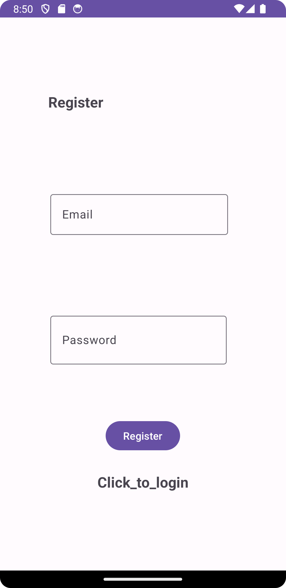
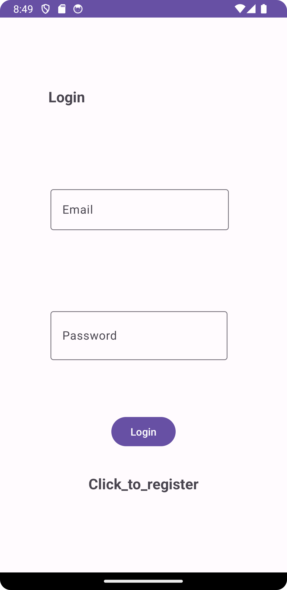
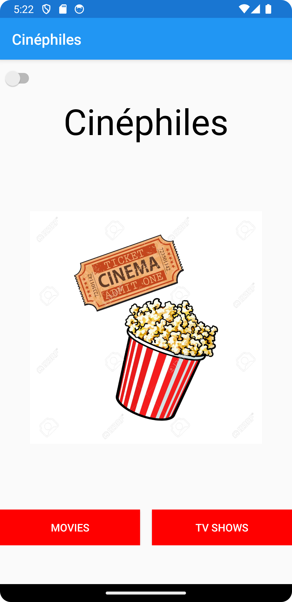
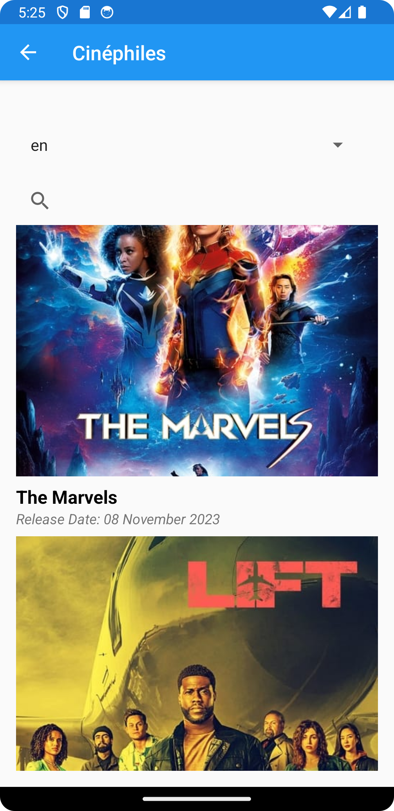
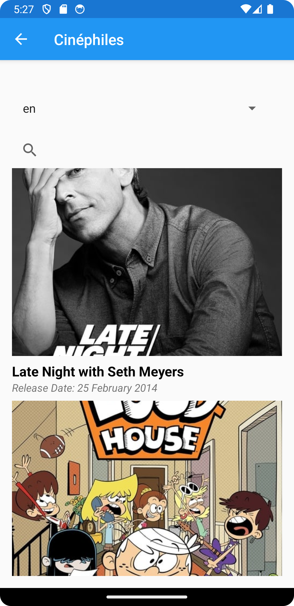
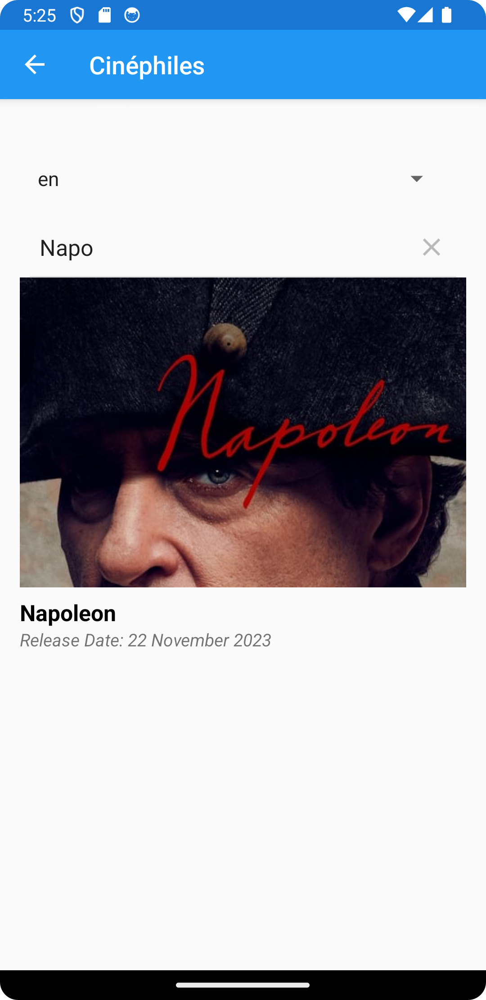
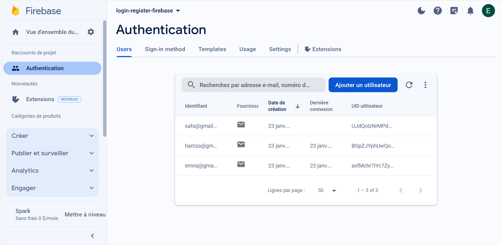

# Cinéphiles
Cinéphiles is a movie and TV show exploration app that utilizes the api.themoviedb API for content information and Firebase as its database. The app provides various interfaces for users to navigate through different functionalities.

## Features
### 1. Authentication
The app starts with a user-friendly login interface where users can enter their credentials. If new to Cinéphiles, there's a convenient registration interface for creating a new account. Registration details : username and password, are securely stored in Firebase.

    
    

### 2. Movie and TV Show Lists
Cinéphiles presents users with a curated list of movies and TV shows fetched from api.themoviedb. The interface displays key information about each item, allowing users to explore its content.

    
    

### 3. Details View
By clicking on any movie or TV show from the list, users can access detailed information about the selected item. This includes plot summaries, release dates, and other relevant details, offering a comprehensive view of the chosen content.

### 4. Search and Filters
Cinéphiles enables users to search for specific movies or TV shows based on their names. The app also features a filtering mechanism, allowing users to refine their searches according to language preferences.

## Technologies Used
**API Integration** : The app integrates seamlessly with api.themoviedb to fetch up-to-date information about movies and TV shows.

**Firebase Database**: Firebase is used as the backend database for securely storing user registration details.

